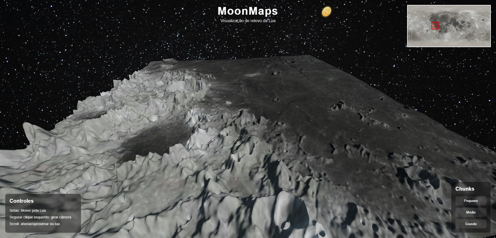

# MoonMaps 🌕

MoonMaps é um projeto desenvolvido para a **Global Solution 2026 da FIAP**.

O objetivo do projeto é permitir a exploração interativa do relevo da Lua utilizando dados reais de heightmaps e texturas lunares da NASA. O usuário pode navegar pela superfície lunar, visualizar crateras, mover a câmera livremente e explorar diferentes regiões do satélite natural da Terra.

---

## 📸 Screenshot

---

## 🛠️ Tecnologias utilizadas

* JavaScript
* Three.js
* Python
* HTML/CSS

---

## 🚀 Como executar o projeto

Acesse o link: [https://felipesantosribas.github.io/moon-project/](https://felipesantosribas.github.io/moon-project/)

Ou

Execute pelo VS Code utilizando a extensão **Live Server**.

### Passos

1. Instale a extensão **Live Server**
2. Abra a pasta do projeto no VS Code
3. Clique com o botão direito no `index.html`
4. Clique em **Open with Live Server**

O projeto será aberto automaticamente no navegador.

---

## 📚 Créditos

Dados e texturas lunares obtidos através de recursos públicos da NASA e LROC (https://svs.gsfc.nasa.gov/4720).

---

## 👨‍💻 Projeto acadêmico

Projeto desenvolvido para a **Global Solution 2026** da FIAP.
